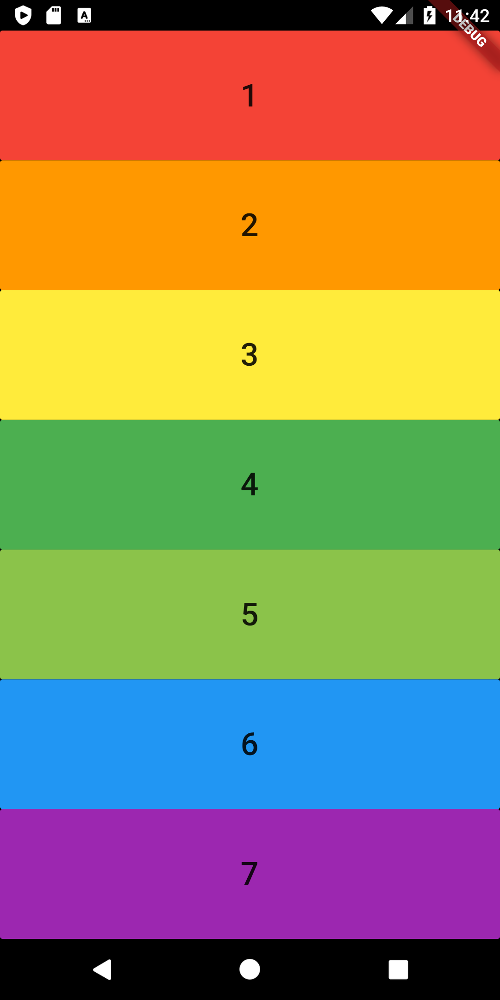

# Xylophone 🎹

## 🤔 What is this App?!

It is a music app that plays Xylophone sounds. For every Beethoven out there, this will let you unleash your musical talent where ever you are. 

## What I Learned

- How to incorporate open source libraries of code into your project using Flutter Packages.
- How to play sound on both iOS and Android.
- How to generate repeated user interface Widgets.
- How to use Dart functions that can take input arguments as well as return an output.
- Dart arrow syntax for writing one line functions.

## Screenshot

